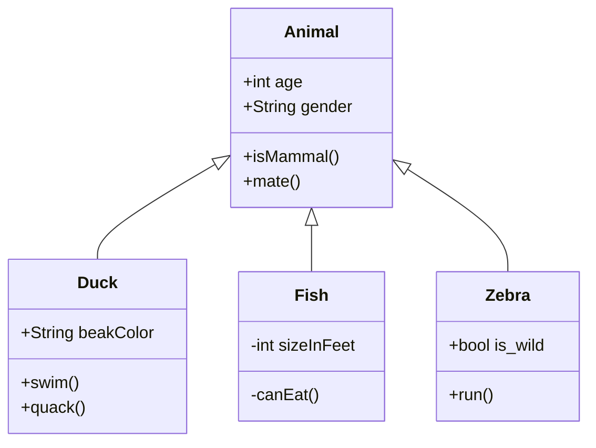

 

 

<!--MERMAID {width:50}-->

<!--MCONTENT {content: "classDiagram \nAnimal <|-- Duck \nAnimal <|-- Fish \nAnimal <|-- Zebra \nAnimal : +int age \nAnimal : +String gender \nAnimal: +isMammal() \nAnimal: +mate() \nclass Duck{ \n+String beakColor \n+swim() \n+quack() \n} \nclass Fish{ \n\\-int sizeInFeet \n\\-canEat() \n} \nclass Zebra{ \n+bool is\\_wild \n+run() \n} \n\n "} --->

 

This file was generated by Swimm. [Click here to view it in the app](https://swimm-web-app.web.app/repos/Z2l0aHViJTNBJTNBZG9jdXNhdXJ1cyUzQSUzQW5hZGF2LXN3aW1t/docs/53u2wi99).
